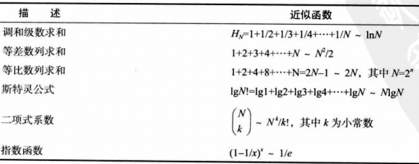
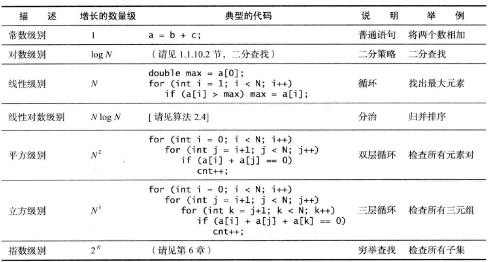

# 1.3 背包、队列和栈
前面的被略过
***
## 链表
### 定义
链表是一种递归的数据结构，它或者为空，或者是指向一个结点的引用，该节点含有一个泛型的元素和一个指向另一条链表的引用
### 构造链表
```Java
Node first  = new Node();
Node second = new Node();
Node third  = new Node();

first.item = "to";
second.item = "be";
third.item = "or";

first.next = second;
second.next = third;
```
### 基于链表的栈(Stack)
栈的特点
- Push和Pop都只修改链表的表头，因此是先入后出的
- 需要实现size() isEmpty() push() pop()
### 基于链表的先入先出队列(FIFO Queue)
- 队列的Enqueue操作链表的表尾，Dequeue操作表头
- 需要实现size() isEmpty() dequeue() enqueue()
### 基于链表的背包(bag)
背包是可迭代的，要引入Iterator，并实现相关方法，current hasNext()  remove() next()
## 综述
数组和链表都能存放数据，常被称为顺序存储和链式存储
| 数据结构       |   优点        | 缺点      |
| ------------- |:-------------:| -----:|
| 数组 |通过索引可以直接访问任何元素|在初始化时就需要知道元素数量|
| 链表      |使用的空间与元素数量成正比|需要通过引用访问任意元素|
本书识别目标并使用数据抽象解决问题
1. 定义API
2. 根据特定的应用场景开发用例代码
3. 描述一种数据结构（一组值得表示），并在API所对应的抽象数据类型的实现中根据它定义类的实例变量；
4. 描述算法（实现一组操作的方式），并根据它实现类中的实例方法
5. 分析算法的性能特点
# 1.4 算法分析
确定运行时间的数学模型所需的步骤
1. 确定输入模型，定义问题的规模
2. 识别内循环
3. 根据内循环中的操作确定成本模型
4. 对于给定的输入，判断这些操作的执行频率。这可能需要进行数学分析。

