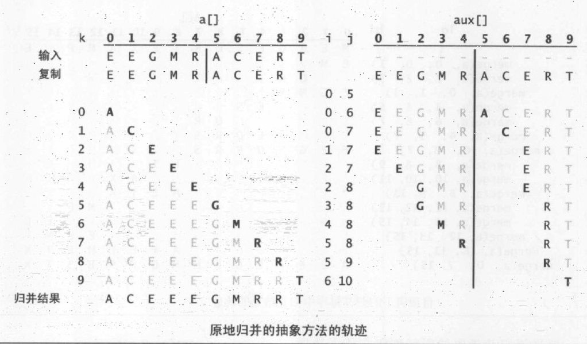
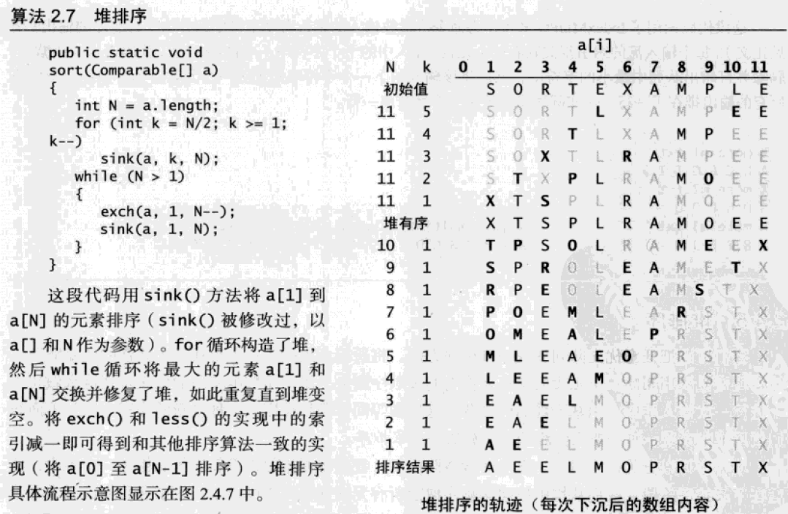

# 排序
## 初级排序算法
### 选择排序
#### 过程
1. 找到数组中最小的数
2. 将它与第一个数交换位置
3. 在剩下元素中寻找最小元素
4. 与第二个数交换位置
5. 循环直到整个数组排序
#### 特点
* 对于长度为N的数组，大约需要N^2/2次比较，N次交换
* 运行时间和输入无关
* 数据移动是最少的，为N次v
### 插入排序
#### 过程
将每一张牌插入到左边的有序组合中，同时还要考虑右移以腾出空间
#### 特点
* 平均情况做N^2/4次比较和N^2/4次交换，最坏情况做N^2/2比较和N^2/2次交换
* 部分有序数组效率高
    * 数组中每个元素距离它的最终位置不远
    * 有序大数组接一个小数组
    * 数组只有几个元素位置不正确
### 希尔排序
#### 过程
1. 比较h距离的元素，使间隔h距离的元素有序
2. 减小h，再次排序
3. 直到h=1，比较相邻元素
#### 特点
* 冲破二次时间屏障的第一批算法之一
* 对于中等大小的数组，运行时间可接受。代码量很小，且不需要额外的内存空间。如果需要解决一个排序问题而又没有系统排序函数可用，可以先用希尔排序，然后再考虑是否值得将它替换为更复杂的算法。
## 归并排序
> 递归实现的归并排序是算法设计中分治思想的典型应用。
### 原地归并
#### 过程
1. 复制原数组
2. 分成两个数组
3. 对两个数组分别排序
4. 对两数组第一位进行比较，取较前的
5. 下一次比较的是，未取的数组的第一位，已取的数组的第二位
6. 以此类推
7. 如果界限不在中间，则小的数组比较完之后，大的数组的尾部直接赋给结果的尾部

### 自顶向下的归并排序
```Java
public class Merge
{
    private static Comparable[] aux;
    public static void sort(Comparable[] a)
    {
        aux = new Comparable[a.length];
        sort(a, 0, a.length - 1);
    }
    private static void sort(Comparable[] a, int lo, int hi)
    {   //将数组a[lo...hi]排序
        if(hi <= lo) return;
        int mid = lo +(hi - lo)/2;
        sort(a, lo, mid);
        sort(a, mid+1, hi);
        merge(a, lo, mid, hi);
    }
}
```
#### 性质
1. 进行1/2NlgN到NlgN次比较
2. 最多需要访问6NlgN次数组
3. 由1和2可知归并排序所需的时间与NlgN成正比
#### 继续缩短时间
1. 对小规模子数组使用插入排序
2. 测试数组是否已经有序
3. 不将元素复制到辅助数组
## 快速排序
### 特点
1. 实现简单
2. 原地排序，只需要一个很小的辅助栈
3. 将长度为N的数组排序所需的时间和NlgN
4. 主要缺点是十分脆弱，在实现时需要非常小心才能避免低劣的性能
### 实现
1. 切分
2. 分别排序

切分的要求是:切分点左边的元素都比切分点小,右边的都大,至少在中点,因此切分点的计算是快排的核心.另外,也使用随机打乱数组使切分点更加合理.
# 优先队列
## 类型
* 数组实现（无序）：使用无序的数组存储，insert和栈中的push一样。delMax就使用了一个排序算法，将最大元素和边界元素交换
* 数组实现（有序）：insert和push不一样，insert将所有较大元素向右边移动一格

> 使用无序序列是解决这个问题的 **惰性** 方法，我们仅仅在必要的时候才会采取行动（找出最大元素）；使用有序序列则是解决问题的积极办法，因为我们尽可能未雨绸缪（在插入元素时就保证列表有序），是后续操作更有效
### 堆
#### 上浮(swim)
就是把节点与父节点对比，若大于父节点则与父节点交换，再次比较，直到小于父节点为止。
#### 下沉(sink)
把节点与子节点对比，若小于其中一个，则交换，若小于两个，则与较大的交换。直到节点大于两个子节点。
#### 堆排序

> 堆排序主要的工作都是在第二阶段完成的。这里我们将堆中最大的元素删除，然后放入堆缩小后数组空出的位置。这个过程和选择排序有点类似（按照降序而非升序取出所有元素），但所需的比较要少得多，因为堆提供了一种从未排序部分找到最大元素的有效方法。（第一段循环构造堆，第二段循环在下沉排序中销毁堆

> **堆排序在排序复杂性的研究中有着重要的地位** 因为它是我们所知的唯一能够同时最优地利用空间和时间的方法——在最坏的情况下它也能保证使用~2NlgN次比较和恒定的额外空间。当空间十分紧张的时候（例如嵌入式系统和低成本的移动设备）它很流行，因为它只用几行（甚至机器码）就能实现较好的性能。但现代系统许多应用很少使用它，因为它无法使用缓存。数组元素很少和相邻的其他元素比较，因此缓存命中的次数要远远高于大多数比较都在相邻元素间进行的算法。</br>
另一方面，用堆实现的优先队列在现代应用程序中越来越重要，因为它能在插入操作和删除最大元素操作混合的动态场景中保证对数级别的 **运行时间**。
