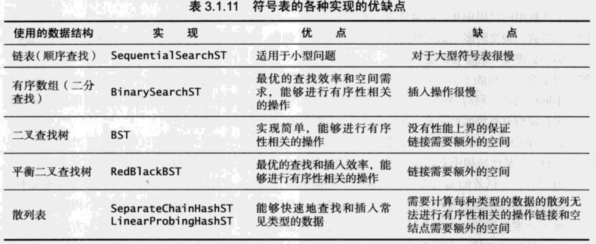
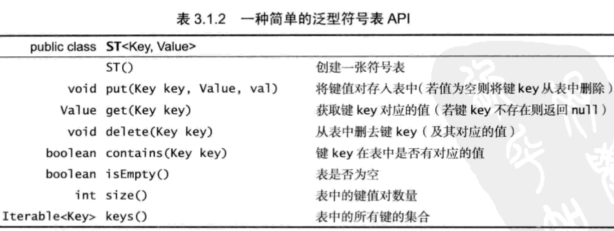
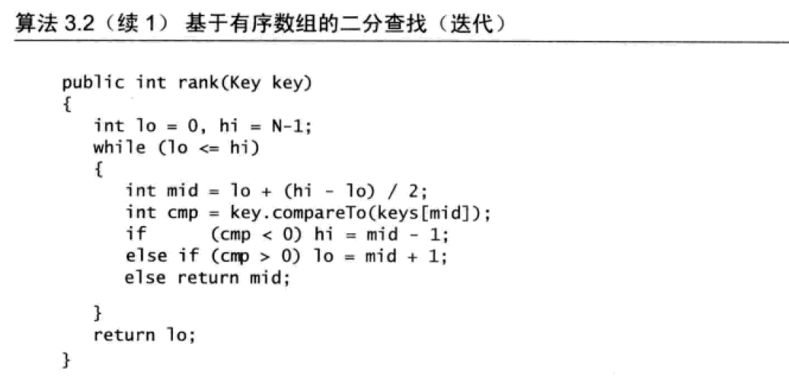

使用符号表这个词来描述一张抽象的表格，我们将值存储其中，用键来搜索并获取这些信息。符号表有时被称为字典。符号表最主要的目的是将一个键与一个值联系起来

符号表要实现这些API

有序符号表的API

# 无序链表中的顺序查找
过程(读)
1. 从first开始
2. 用next遍历，将key与目标key对比，若value相等，return
3. 直到next指向null结束
过程(写)
1. 若key相同，选择覆盖/拒绝？
2. key不同则和一般链表插入node一样，修改first的next指向
# 有序数组二叉查找
核心在于rank()函数，其实现过程如下，这不是树结构，只是在查找的时候用二叉查找，存储是用有序数组实现的
1. 计算中点mid
2. lo < hi的情况下进入一个无限循环
3. 循环：比较mid位置的key与目标key，直到相同就返回
4. 如果目标key与任何的key都不相同，则逼近过程中，lo和hi会超过循环的条件，返回lo值
