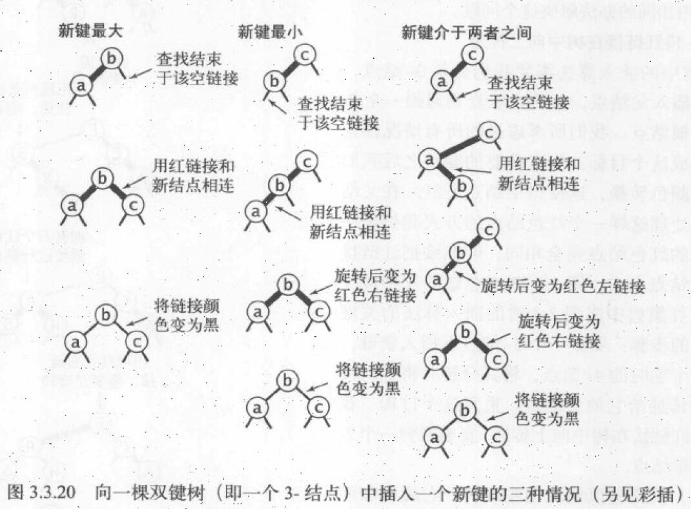

使用符号表这个词来描述一张抽象的表格，我们将值存储其中，用键来搜索并获取这些信息。符号表有时被称为字典。符号表最主要的目的是将一个键与一个值联系起来

符号表要实现这些API

有序符号表的API


# 无序链表中的顺序查找
过程(读)
1. 从first开始
2. 用next遍历，将key与目标key对比，若value相等，return
3. 直到next指向null结束
  过程(写)
4. 若key相同，选择覆盖/拒绝？
5. key不同则和一般链表插入node一样，修改first的next指向
# 有序数组二叉查找
核心在于rank()函数，其实现过程如下，这不是树结构，只是在查找的时候用二叉查找，存储是用有序数组实现的
1. 计算中点mid
2. lo < hi的情况下进入一个无限循环
3. 循环：比较mid位置的key与目标key，直到相同就返回
4. 如果目标key与任何的key都不相同，则逼近过程中，lo和hi会超过循环的条件，返回lo值
  
# 二叉查找树BST
以二叉树的结构存储。我所关心的问题：BST中左子树的key都小于当前key，右子树都大于。然而在之前的二叉堆中却仅仅是左节点小于当前节点？又或者是普通的二叉树没有这样的限制？看put函数发现这种二叉树的插入并不难，compare后选择子树，直到最底层的结点.
```Java
public void put(Key key, Value val) {
    if (key == null) throw new IllegalArgumentException("calledput() with a null key");
    if (val == null) {
        delete(key);
        return;
    }
    root = put(root, key, val);
    assert check();
}

private Node put(Node x, Key key, Value val) {
    if (x == null) return new Node(key, val, 1);
    int cmp = key.compareTo(x.key);
    if      (cmp < 0) x.left  = put(x.left,  key, val);
    else if (cmp > 0) x.right = put(x.right, key, val);
    else              x.val   = val;
    x.size = 1 + size(x.left) + size(x.right);
    return x;
}
```
```Java
public Key floor(Key key) {
    if (key == null) throw new IllegalArgumentException("argument to floor() is null");
    if (isEmpty()) throw new NoSuchElementException("called floor() with empty symbol table");
    Node x = floor(root, key);
    if (x == null) return null;
    else return x.key;
} 

private Node floor(Node x, Key key) {
    if (x == null) return null;
    int cmp = key.compareTo(x.key);
    if (cmp == 0) return x;
    if (cmp <  0) return floor(x.left, key);
    Node t = floor(x.right, key);
    if (t != null) return t;
    else return x; 
} 
```
# 平衡查找树
之前的二叉查找树的最坏情况下的性能很糟糕。
## 2-3查找树
什么时候用2节点，什么时候用3节点，由输入数据决定吗？如下
#### 建立2-3查找树的过程
1. 建立2节点
2. 新key并入2节点成为3节点
3. 建立临时4节点，分解成3个2节点构成的树
4. 向父节点为2-节点的3-节点插入新key，也是建立临时4-节点，然后分解，中间的key并入父节点成为3-节点，余下两个成为2-节点
5. 如果路径上所有节点都是3-节点，那么插入新Key需要分解root节点。4-节点的root分解成2-节点。4-节点有4个分支，2个2-节点也有4个分支，转换容易
### 红黑二叉查找树
红黑二叉查找树是2-3查找树实现的方式。
#### 红和黑代表了什么？
红是两个2-结点连接起来3-结点，黑连接则是2-3树中的普通链接。
> 为什么这么做（优点）：我们无须修改即可使用标准二叉查找树的get()方法。对于任意的2-3树，只要对结点进行转换。我们都可以立即派生出一棵对应的二叉查找树。
#### 另一种定义
1. 红连接均为左连接
2. 没有任何一个结点同时和两条红链接相连
3. 该树是完美黑色平衡的，即任意空链接到跟结点的路径上的黑链接数量相同。（如何做到？2-3树自带？）
  如何在代码中区分红黑链接？为什么会有不合法红链接？红右链接是有意义的,可以被转化为合法红链接,连续红链接是一个4-结点,也可以被转化成合法的3个2-链接
#### 结点的插入
1. 向2-结点插入,会形成一个
2. 向3-结点的插入
  
# 散列表(Hash表)
思路:将key作为数组的索引,也就是key->i->value.分两步:
1. 用散列函数将查找的键转化为索引
2. 因为1存在多个键散列到相同索引的情况,所以要处理碰撞冲突.有两种处理冲突的办法
    * 拉链法
    * 线性探测法

## 散列函数

### 正整数

将正整数散列最常用的方法是除留余数法.把正整数取M的余数作为索引,它会散列分布在0~M-1之间,M是素数的时候,它们最平均.

### 浮点数

将它乘以素数M再四舍五入得到一个0到M-1的索引值.但是有一个缺点,最低位对函数的结果没有影响.修正这个问题的方法就是将键表示为二进制数再使用除留余数法.

### 字符串

```Java
int hash = 0;
for (int i = 0; i < s.length; i++) {
  	hash = (R * hash + s.charAt(i)) % M;
}
```

这是把Unicode字符作为一个16Bit整数处理.此处为什么要乘R呢?不乘不也可以吗?

### 组合键

```Java
int hash = (((day * R + month) % M) * R + year) % M
```

只要R足够小不造成溢出,也可以得到一个0~M-1之间的散列值

### Java的约定

Java令所有数据类型都继承了一个能够返回一个32bit整数的hashCode()方法.每一种数据类型的hashCode()方法必须与equals()方法一致,也就是a.equals(b)那么a和b的hashCode()返回的32bit整数必须一致

优秀的散列方法需要满足三个条件

* 一致性
* 高效性
* 均匀性

设计同时满足三个条件的散列函数是专家们的事,Java程序员在使用散列时只需要调用hashCode()方法即可

## 基于拉链法的散列表

如果有多个key的hash相同,那么有一种直接的方法:将大小M的数组每个元素指向一个链表,链表中的每个节点都存储了散列值为该元素的索引的键值对.基本思想就是选择足够大的M是链表尽可能的短

### 基于线性探测法的散列表

实现散列表的另一种方式是用大小为M的数组保存N个键值对,M>N.我们用数组中的空位来解决碰撞冲突,基于这种策略的方法叫做开放地址散列表

开放地址散列表中最简单的叫做线性探测法:当碰撞发生时,我们直接检查散列表的下一个位置,直到遇到空元素或者命中.有三种状态

1. 命中
2. 未命中
3. 继续查找

