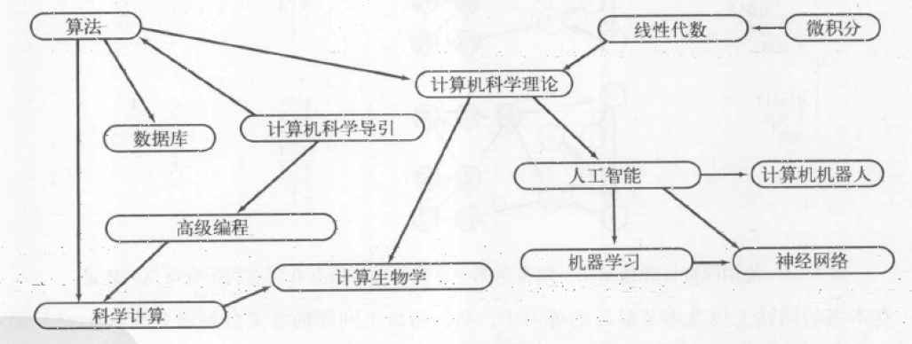
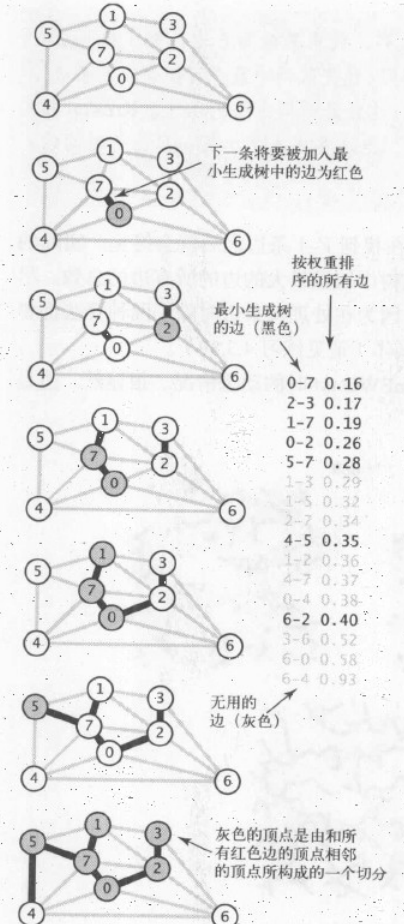

本章中,会学习四种最重要的图模型:无向图(简单连接),有向图(连接有方向),加权图(连接有权值)和加权有向图(连接既带有方向性又带有权值)

# 无向图

## 表示无向图的数据类型

先看一份定义了图的基本操作的API

| public class      | Graph                 | 含义               |
| :---------------- | :-------------------- | :--------------- |
|                   | Graph(int v)          | 创建一个含有V个顶点但不含边的图 |
|                   | Graph(In in)          | 从stdin读入图        |
| int               | V()                   | 顶点数              |
| int               | E()                   | 边数               |
| void              | addEdge(int v, int w) | 添加一条边            |
| Iterable<Integar> | adj(int v)            | 和v相连的所有顶点        |
| String            | toString()            |                  |

相关的函数

* 计算V的度数
* 计算所有顶点的最大度数
* 计算所有顶点的平均度数
* 计算资环的个数
* 图的邻接表的字符串表示

为了满足

* 预留出足够的空间
* 实例方法一定要快

本章采用邻接表数组来表示.也就是以顶点为索引的列表数组,其中每个元素都是和该顶点相连的顶点列表

## 深度优先搜索

1. 选择一条没有标记的通道
2. 标记所有第一次通过的路口和通道
3. 当来到已标记的路口时,回退到上个路口
4. 当回退到的路口已无路可走时继续回退

代码实现

```Java
private void dfs(Graph G, int v)
{
  marked[v] = true;//标记
  for (int w : G.adj(v))//遍历v下所有连接的节点
    if (!marked[w])//如果已标记就退回
    {
      edgeTo[w] = v;//记录
      dfs(G, w);//再遍历w
    }
}
```
## 广度优先搜索
1. 标记起点，加入队列
2. 进入循环
3. 循环中，从队列取出一个元素，遍历
4. 遍历的操作是标记并加入队列，标记到edgeTo，如果已标记则不加入队列
5. 直到队列为空，退出循环

```Java
private void bfs(Graph G, int s) {
    Queue<Integar> queue = new Queue<Integar>();
    marked[s] = true;
    queue.enqueue(s);
    while (!queue.isEmpty())
    {
        int v = queue.dequeue();
        for (int w : G.adj(v))
            if (!marked[w])
            {
              edgeTo[w] = v;
              marked[w] = true;
              queue.enqueue(w);
            }
    }
}
```
# 有向图

有向图，顾名思义就是顶点之间是以单向边连接的，有向图的标准数据结构比无向图更简单。

有向图的可达性，可以用无向图中DFS代码直接得到，无须修改

### 环和有向无环图

两个和有向环有关的原型应用

#### 调度问题

有向图中的顶点可以表示各个任务，有向边表示它们的优先级。



如果一个优先级调度问题存在有向环，那么它是无解的，所以需要有向环检测

有向环检测很简单，如果从一个节点出发，遍历边，并标记，如果遇到已标记的节点，那么就存在环。

## 有向图的强连通性

有向图的强连通性有以下性质

* 自反性：任意顶点v和自己都是强连通的
* 对称性：如果v和w是强连通的，那么w和v也是强连通的
* 传递性：如果v和w是强连通的，w和x强连通，那么v和x也是强连通的

### Kosaraju算法

## 最小生成树

加权图是一种为每条边关联一个权值或是成本的图模型。给定一副加权无向图，找到它的一棵最小生成树。

最小生成树的两种经典算法：Prim算法和Kruskal算法

#### 切分定理
把图的所有定点分成两个非空且不重复的两个集合，横切边是连接它们的边，横切边最小的必然属于图的最小生成树

#### 贪心算法
使用切分定理找到最小生成树的一个边，不断重复直到找到树的所有边。

初始状态所有边均为灰色，找到一种切分，它产生的横切边均不为黑色。将它权重最小的横切边标记为黑色，反复，直至标记了V-1条黑色边。

## 加权无向图的数据类型
与之前的图不同的是，我们这里要构造一个Edge类型来存储边，这样可以支持更加复杂的加权无向图类型。

## Prim算法
Prim算法是不断为生长中树增加边。一开始只有一个顶点，每次总是将树中顶点与不在树中顶点的最小边加入树。原文；每次总是将下一条连接树中的顶点与不在树中的顶点且权重最小的边加入树中。

如何才能找到最小权重的横切边呢？人们提出了许多方法。


通过这个图可以很好的理解prim算法。
1. 加入顶点
2. 把所有邻接链表中的边加入优先队列
3. 弹出优先队列(横切边)的min项
4. 加入新的顶点，重复1
5. 如果边的两个顶点都在树中则忽略

prim算法所需时间与ElogV成正比，空间和V成正比

## Krustal算法

Krustal算法也使用优先队列。它的过程就像是根据边的权重，逐渐构建出一片森林，最后把森林连成一棵树。



# 最短路径

最短路径可以看成开车从一条单向道去往目的地的最短路径。归纳成，找到从一个顶点到另一个顶点的成本最小的路径

解决最短路径有经典的Dijkstra算法，它的条件是边权重不能为负，如果是无环加权有向图有一种快速算法，适用于一般情况-可能有环，可能负权重的Bellman-Ford算法

最短路径树。给定一个起点，我们可以找到从起点到达任何其他顶点的最短路径树。

## 加权有向边的数据结构

概念：松弛。放松边v->w意味着先检查起点s->w的最短路径是否是先从s->v再v->w。所以会有两种情况，边失效，经过v不如原本的最短路径。另一种就是，v->w就是在最短路径上，这会更新edgeTo[w]和distTo[w]，

松弛这个术语来自于用一根橡皮筋沿着最短路径紧紧展开的比喻，放松一条边就相当于将橡皮筋转移到了一条更短的路径上，从而缓解了橡皮筋的压力。