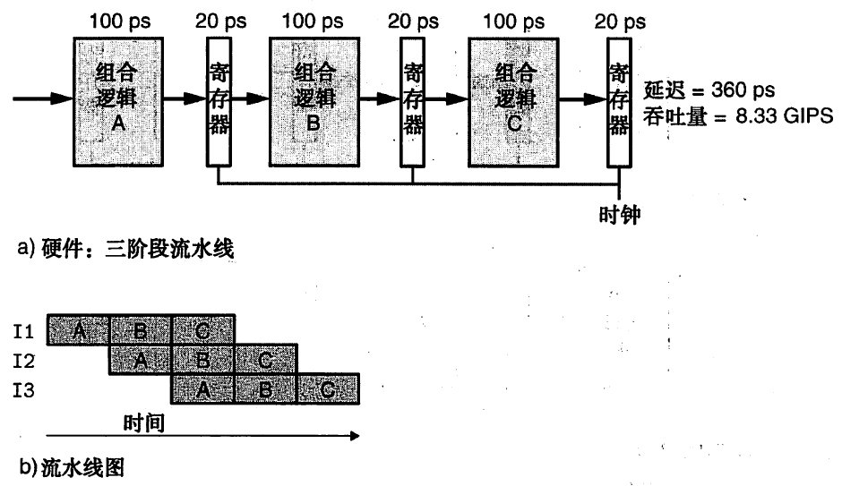

# 摘抄
|C版本|GCC命令行选项|
|-----|-----------:|
|GNU 89|无，-std=gnu89|
|ANSI,ISO C90|-ansi,-std=c89|
|ISO C99|--std=c99|
|GNU 99|-std=gnu99|

|C声明|IA32|x86-64|
|----|:------:|------:|
|char|1|1|
|short int|2|2|
|int|4|4|
|long int|4|8|
|long long int|8|8|
|char *|4|8|
|float|4|4|
|double|8|8|
|long double|10/12|10/16|

# 第三章 程序的机器级表示
仍在使用的技术
* 平坦寻址 flat-addressing
* X87浮点指令模型，但是更推荐使用SSE指令集
## 调用函数
1. 在调用者的栈帧放入参数
2. 调用时，压入返回地址、
3. 执行完毕之后，弹出地址（即栈顶），继续执行
# 第四章
## 流水线
流水线的过程是怎样的

以此图为例，执行过程A，结果保存在寄存器中，下个时间，可以再次执行A，B从寄存器中读取数据来执行。如果没有这个寄存器暂时存放数据，那么同时执行A和B可能会出错
> 另一方面，如果时钟运行得太快,就会有灾难性后果.值可能会来不及通过组合逻辑,并且时钟上升时，寄存器的值还不是合法的值。
1. 划分不一致。运行时钟的速率是由最慢阶段的延时限制的。
2. 流水线过深。效率下降。
# 第五章 优化程序性能
> 1. 程序优化的第一步就是消除不必要的内容，让代码尽可能有效地执行它期望的工作。这包括消除不必要的函数调用、条件测试和存储器引用
> 2. 了解了处理器的运作，我们就可以进行程序优化的第二步，利用处理器提供的指令级并行能力，同时执行多条指令

内联函数可以减少对函数的调用，在编译时直接将函数体替换上去，方便了编译器的优化
***
# 归纳总结思考
## 第三章
### 数据问题
C/C++编译器、汇编编译器、JVM在IA32和X86_64下的各变量存储长度到底是多少？甚至扩展一下ARM的C/C++编译器、汇编所用的存储长度是多少？
* 普通ARM的字长是32位，半字长是16位
* X86平台，字是16位，双字是32位，四字是64位
* 各变量的长度如上表，在C/C++和汇编下的表现是一致的
* IA32也能处理int64，只是速度慢
* jvm下，没有long long类型，short int long 占2 4 8个字节，float、double占4 8个字节，char占2个，而C/C++占1个，jvm的byte占一个字节，C/C++没有byte，unsigned char可与之对应
### 存储问题-物理实现
在程序中何处体现了寄存器、堆栈、内存、ROM的区别？
* 时钟寄存器与随机访问存储器的区别
### 指令长度问题
IA32/ARM/MCS-51他们的指令长度有哪些？
* ARM普通指令长度是32位，thumb指令是16位