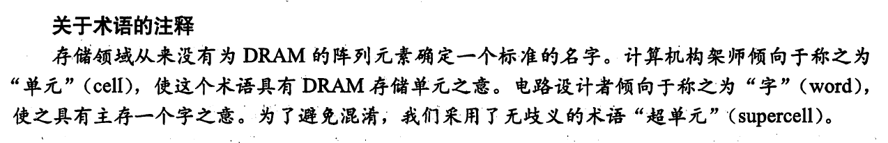
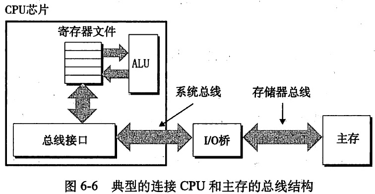
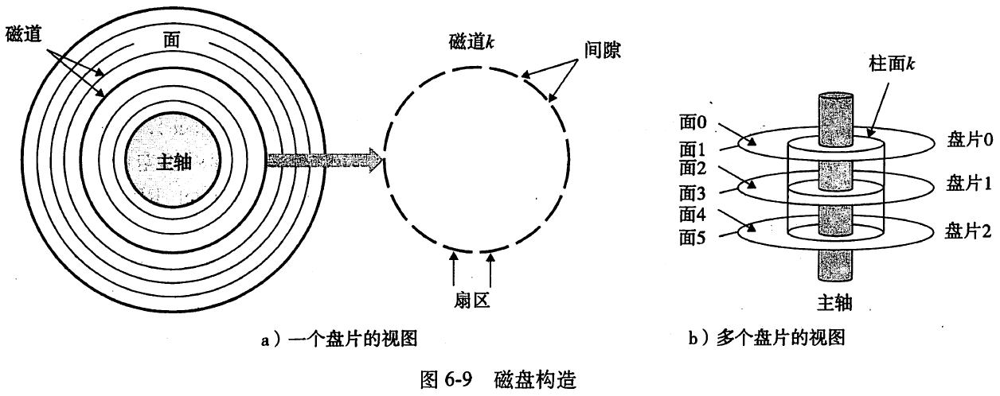
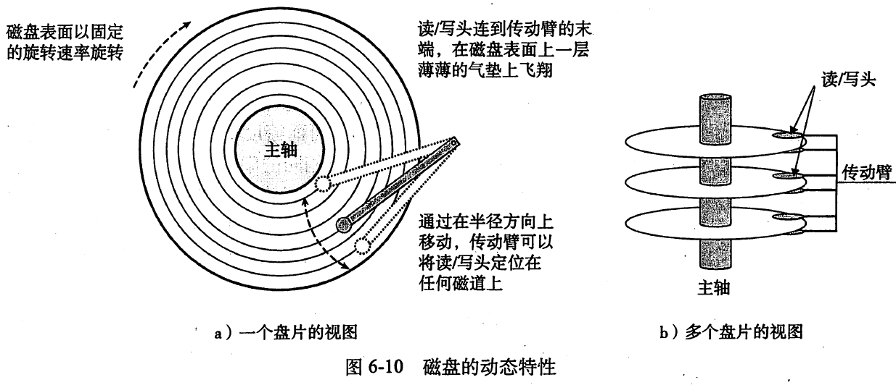
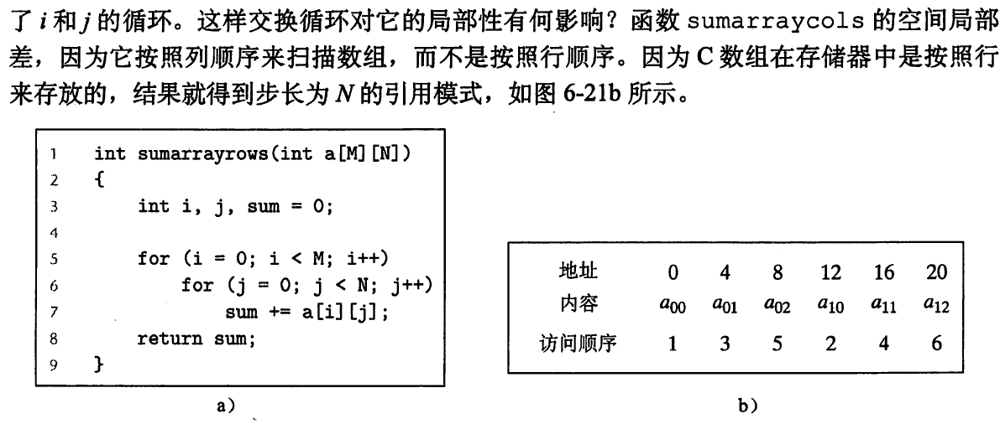
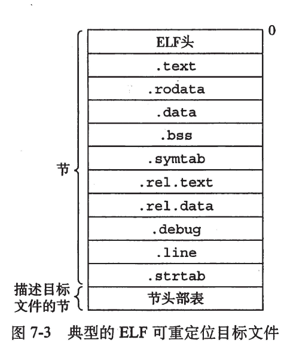

# 存储器层次结构
## RAM是什么，ROM又是什么
ram分为静态RAM和动态RAM，也就是SRAM和DRAM。DRAM的原理是不断地往超单元里读写数据，达到保持的效果，DRAM的存储的数据容易收到干扰丢失，而SRAM只要在通电的情况下，其存储的数据都几乎不会丢失，因此无须快速的刷新它。
> ### 超单元是什么
> 

现在最常见的是DDR SDRAM(双倍数据速率同步DRAM)。 
> 如果断电，RAM会丢失它们的信息，从这个意义上来说，它们是易失的。另一方面，非易失性存储器即使在关电后，也仍然保存信息。由于历史原因，虽然ROM中有的类型既可以读又可以写，但它们整体上都称为ROM。

ROM以它们重编程的次数和方式分类，分为PROM(可编程ROM，只能编程一次)->EPROM(可擦写编程ROM，在紫外光照射下擦除，max=10^3)->EEPROM(电子可擦写ROM，无须紫外光就可以擦除, max=10^5)->flash(基于EEPROM)
## 如何访问主存
答案是总线。 
CPU->总线->I/O桥->主存

在Intel系统中，北桥和南桥芯片组分别连接到存储器和I/O设备。
## 磁盘如何工作

磁头在盘面上高速飞行，中间有一层薄薄的气垫。因此磁盘必须在无尘条件下工作，否则尘埃颗粒会高速撞击读写头，使读写头撞到盘面。
## 优化性能的另一种方式-局部性
### 什么是局部性
> 一个编写良好的计算机程序常常具有良好的局部性。也就是说，它们倾向于引用邻近于其他最近引用过的数据项的数据项，或者最近引用过的数据项本身。这种倾向性，被称为局部性原理。 局部性通常有两种形式：
> 1. 时间局部性。被引用过一次的存储器位置可能在不远的将来再被多次引用。
> 2. 空间局部性。如果一个存储器位置被引用了一次，那么程序可能在不远的将来引用附近的一个存储器位置。
### 示例

数组的行是连续的，列之间有分隔。
## 如何编写高速缓存友好(cache friendly)的代码
尽可能地提高缓存命中率
* 对局部变量的反复引用
* 步长为1的引用模式。第一次引用未命中，缓存会一次载入一个块，因此下一次引用块内的数据速度会更快。
# 链接
## 什么是链接，为什么需要链接
> 链接是将各种代码和数据部分收集起来并组合成为单一文件的过程，这个文件可被加载（或拷贝）到存储器并执行。

链接可以执行于
1. 编译时(compile time)
2. 加载时(load time)
3. 运行时(run time)

静态链接器做了哪些，对可重定位目标文件（由不同的代码和数据节组成）
1. 符号解析。目标文件定义和引用符号。目的是将每个符号引用刚好和一个符号定义联系起来。
2. 重定位。链接器通过把每一个符号定义与一个存储器位置联系起来，然后修改对这些符号的引用，使得他们指向这个存储器位置，从而重定向这些节。
### 概念解释|什么是目标文件，什么是符号符号表，重定位如何实现
#### 目标文件(Object)
1. 可重定位目标文件。包含二进制代码和数据，可在编译时与其他可重定位目标文件合并起来，创建一个可执行文件
2. 可执行目标文件。包含二进制代码和数据，可直接执行。
3. 共享(shared)目标文件。特殊的可重定位目标文件，可在加载或运行时被动态地加载到存储器并链接

现代Unix系统使用的是Unix可执行和可链接格式，即ELF
#### 第一种可重定位目标文件
</img>
|节|作用|
|:--|:--:|
|.test|已编译程序的机器源码|
|.rodata|只读数据|
|.data|已初始化的全局C变量|
|.bss|未初始化的全局C变量|
|.symtab|一个符号表。它存放着程序中定义和引用的函数和全局变量的信息|
|.rel.test|一个text节中位置的列表|
|.rel.data|被模块引用或定义的任何全局变量的重定位信息|
|.debug|一个调试符号表|
|.line|原始C程序中行号和.text节中机器指令的映射。只有以-g选项调用编译驱动程序才会得到这张表|
|.strtab|一个字符串表|
符号表也分为
1. 由m定义的，能被其他模块引用的全局符号。对应不带C static属性的全局变量
2. 由其他模块定义的，并被m引用的全局符号。称为external外部符号
3. 只被m定义和引用的本地符号。对应C static
#### 什么是动态链接(what)，如何使用(how)
动态链接用于解决静态链接的缺陷，包括
1. 静态库需要定期维护更新，程序员要显式地将程序与更新后的库链接
2. 库里用不着的函数也会复制到代码段，这是对存储器的浪费

共享库是致力于解决静态链接缺陷的现代创新产物。动态链接在unix上用.so(shared object)表示，在windows上用DLL(动态链接库)表示
# 异常控制流
> ### 什么是异常控制流
> a0,a1,a2... 这样的控制转移序列叫做处理器的控制流。最简单的控制流是平滑的。现代操作系统通过使控制流发生突变来对这些情况做出反应。一般而言，我们把这些突变称为异常控制流。
## 异常处理过程的名词解释
* 异常，就是控制流中的突变
* 事件，是指状态变化
* 异常表，跳转表
## 异常与过程调用的不同点
1. 处理器把额外的信息压入栈中
2. 异常处理程序运行于内核模式下
## 异常的类别
* 中断
* 陷阱
* 故障
* 终止

|类别|原因|异步/同步|返回行为|
|:--|:---|:--------|:------|
|中断|来自I/O设备的信号|异步|总是返回到下一条指令|
|陷阱|有意的异常|同步|总是返回下一条指令|
|故障|潜在可恢复的错误|同步|可能返回到当前指令|
|终止|不可恢复的错误|同步|不会返回|

中断时异步的。硬件中断的异常处理程序通常称为中断处理程序。剩下的异常类型是同步的，是执行当前指令的结果。我们把这类指令叫做故障指令。

陷阱最重要的用途是提供用户程序和内核之间的一个像过程一样的接口。它与普通函数调用的区别是，普通函数只能运行在用户模式下，访问与调用函数相同的栈，系统调用运行在内核模式中，访问定义在内核中的栈。
