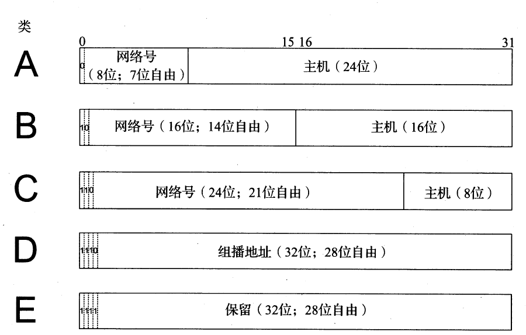
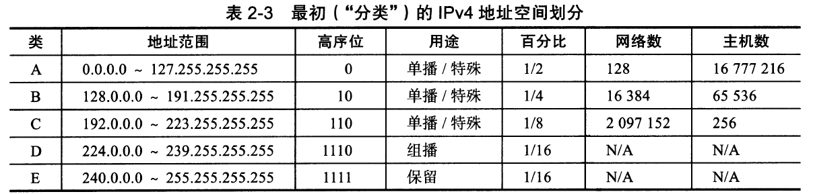

# 摘抄
* 多路可复用
# 第一章
端到端论点，命运共享

ISO的七层OSI模型
1. 物理层
2. 链路层
3. 网络层
4. 传输层
5. 回话层
6. 表示层
7. 应用层

ARPANET
|编号|名称|属于|
|:--|:--|:--|
|7|应用层|主机|
|4|传输层|主机|
|3.5|网络层(辅助)|所有网络设备|
|3|网络层|同上|
|2.5|链路层(辅助)|同上|

IPv4的五类IP空间

# 归纳