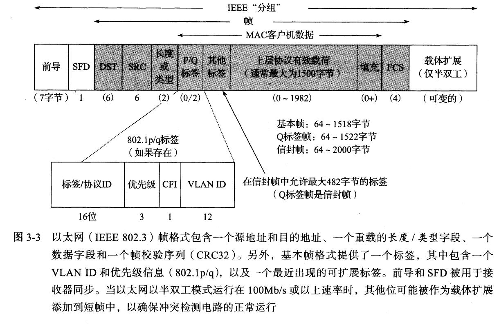
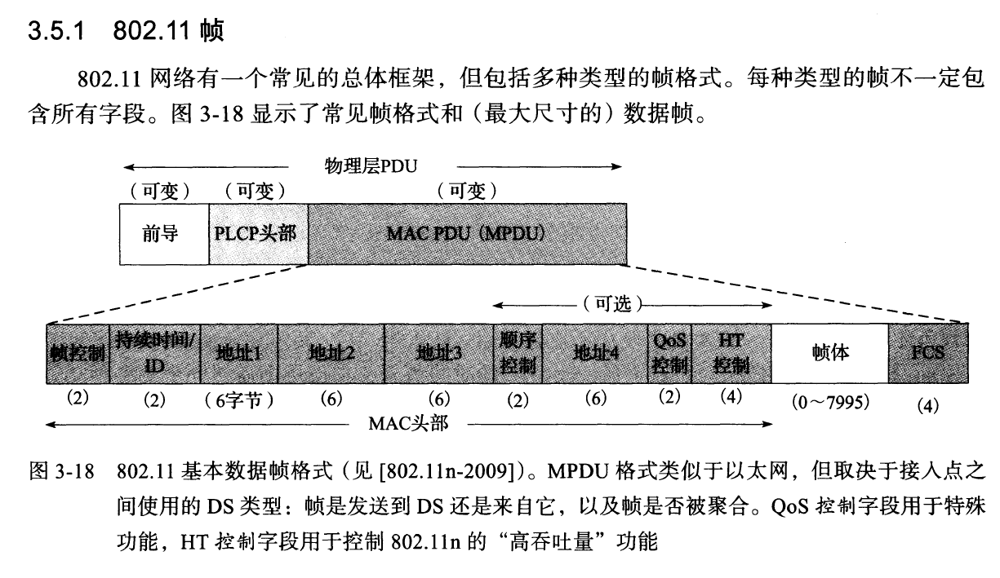
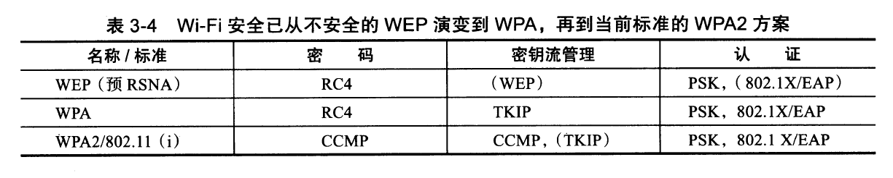

# 摘抄
* 多路可复用
# 第一章
端到端论点，命运共享

ISO的七层OSI模型
1. 物理层
2. 链路层
3. 网络层
4. 传输层
5. 回话层
6. 表示层
7. 应用层

ARPANET
|编号|名称|属于|
|:--|:--|:--|
|7|应用层|主机|
|4|传输层|主机|
|3.5|网络层(辅助)|所有网络设备|
|3|网络层|同上|
|2.5|链路层(辅助)|同上|

IPv4的五类IP空间

## 九十年代的三大问题
1. B类地址空间即将用尽
2. IPv4的规模不足以应付Internet的发展
3. 全球路由表的数目持续增长,这将影响到路由的性能

在后来的发展中,提高层次化分配的IP地址的聚合能力被用于解决1和3,IPv6被用于解决2
### 聚合是什么,为何能解决B类地址空间用尽的问题?
取消分类结构的IP地址,用分层和树的结构优化.

# 第二章 链路层

* DST 目标地址
* SRC 源地址
* CFI CRC循环冗余校验
* VLAN 用于隔离不同VLAN间主机的通信
* 优先级 用于QOS

### 控制帧RTS/CTS和ACK
不同于以太网的PAUSE帧的流控,wifi的流控有以下两种方式
* RTS/CTS就是请求发送和明确发送,当RTS/CTS启用时,一个站发送数据帧之前发送一个RTS帧,当接收方愿意接收额外的流量时,它会响应一个CTS帧,并开启一个时间窗口,用于向确认接收的站发送数据帧.
* ACK即重传/确认,是对802.3重传机制的扩展,
### 更高吞吐量的802.11/802.11n
采用的手段包括
1. 使用相邻的两个20MHz信道构成一个40MHz信道
2. MIMO多输入多输出+OFDM正交频分复用,每个信道可以承载多个载波
3. 更有效的转发纠错编码提高每个流的性能
### Wi-Fi安全
访问控制包括这几种
1. WEP,安全性薄弱
2. WPA,RC4加密+TKIP
3. WPA2,AES+CCMP+(TKIP)
4. 802.1X/EAP(身份验证协议)

# 归纳