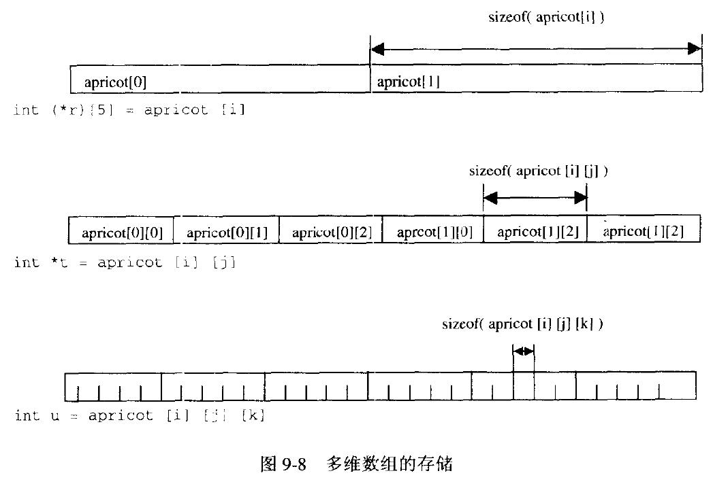
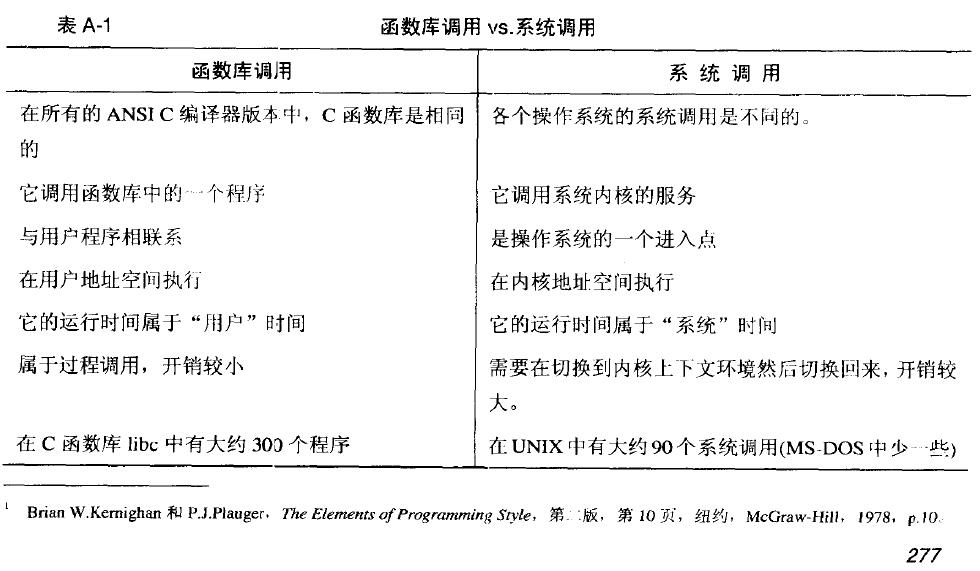
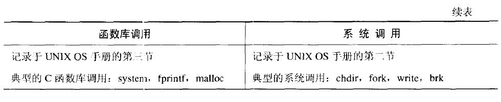

# const
const本身是一个限定符<br>
const char *类型表示一个指向const char的指针，因此这段代码是错误的
```C
char *cp;
const char *ccp;
//ccp初始化后
cp = ccp;
```
cp和ccp是两个类型的变量了
# break
break跳出的最近的那层循环语句或switch语句。如果错误地使用break会引起严重后果。
# 自动合并字符串
ANSI C中相邻字符串自动连接，省掉了过去加\符号的做法
# 数组与指针的区别是什么？
本质上，数组的引用时直接引用，指针是间接引用。
|指针|数组|
|:--|:--|
|保存数据的地址|保存数据|
|间接访问数据，先取得指针内容，再将其作为地址取数据|直接访问数据，简单地从地址取得数据|
|通常用于动态数据结构|通常用于存储固定数目且数据类型相同的数据|
|相关函数为malloc(), free()|隐式分配和删除|
|通常指向匿名函数|自身即为数据名|
# 绝大多数OS中栈是向下增长--即向低地址的地方
# 再论数组
## 数组在什么情况下和指针相同?
1. 作为函数的参数
2. 用于表达式的时候

以上两种情况,数组被作为指向第一个元素的指针

3. 下标总是与指针的偏移量相同

其他的情况数组与函数本质就不一样,数组本质是地址,而指针是地址的地址

## 多维数组
Ada语言里,严格划分了数组的数组和多维数组的区别,Pascal里二者可以互换.它们在实际的存储中是一样的,C语言里定义和引用多维数组唯一的方法就是使用数组的数组.<br>
Pascal中,多维数组的下标风格[i,j,k]<br>

所以r++和t++的步长就不一样,r指向apricot[i+1],t指向apricot[i][j+1]<br>
另外,C语言多维数组最右的下标先变化,和Fortran相反,如果传递一个数组到Fortran,会自动转置
# 再论指针

# 附录
## 如何检测链表中存在循环
## 库函数调用比系统调用快

