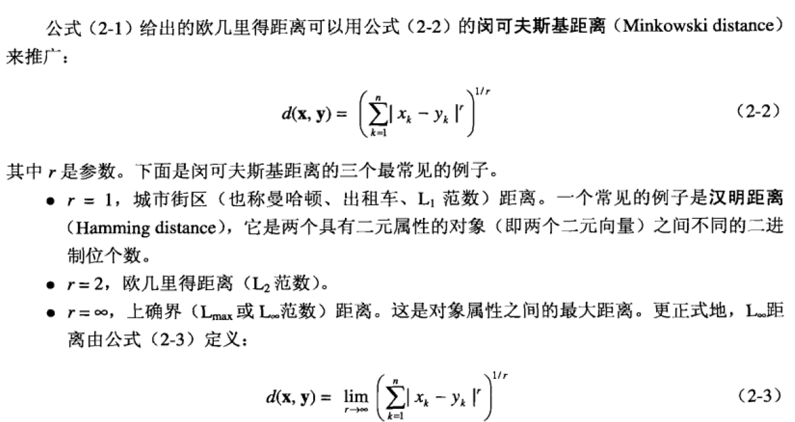
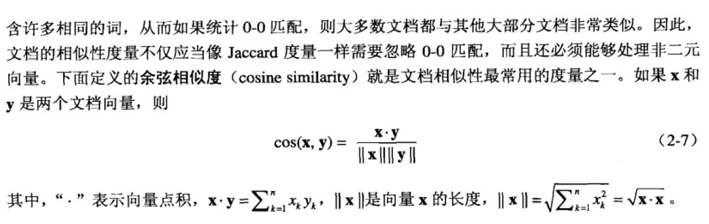
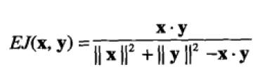
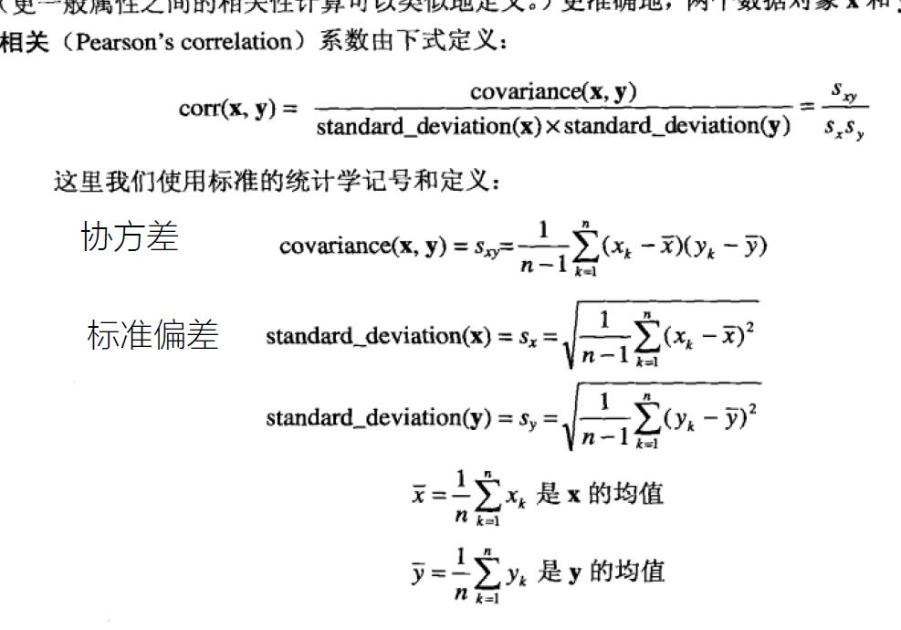

# 第二章 数据
### 数据集的类型
1. 维度
2. 稀疏性，如具有非对称特征的数据集，一个对象的大部分属性值都为0；在许多情况下，非零项还不到1%。实际上稀疏性是一个优点，因为只有非零值需要存储和处理。这将节省大量的计算时间和存储时间。此外，有些数据挖掘算法仅适合处理稀疏数据。
3. 分辨率。如果分辨率太高，模式可能看不出，或者掩埋在噪声中；如果分辨率太低，模式可能不出现。
### 测量和收集数据
1. 测量误差和数据收集错误
2. 噪声和伪像，伪像是错误，是有规律的，不同于噪声，比如照片中的条纹。
3. 精度、偏倚和准确率，准确率.精度是测量值之间的差，偏倚是测量值和真实值得差，准确率是依赖于精度和偏倚。
4. 离群点，离群点是合理的，不同于噪声，有时离群点就是我们感兴趣的目标
5. 遗漏值
6. 不一致的值
7. 重复数据
## 数据预处理
1. 聚集，聚集将标度改变，如天->月，小地区->大地区，减少了处理数据集所需的时间空间，同时也丢失了一部分信息
2. 抽样。数据挖掘和统计学抽样的目的不一样，数据挖掘是为了减少处理数据集的成本，统计学是因为无法获得完整地数据集。抽样主要分为：简单随机抽样，分层抽样，渐进抽样。
3. 维规约
4. 特征子集选择
5. 特征创建
6. 离散化和二元化
7. 变量变换
## 相似性与相异性的度量
距离的计算：闵科夫斯基距离

### 邻近性度量的例子
#### 二元数据的相似性度量
设xy是两个对象，都有n个二元属性组成。这两个对象可生成四个量（频率）
1. f00 = x取0且y取0的属性个数
2. f01 = x取0且y取1的属性个数
1. f00 = x取1且y取0的属性个数
1. f00 = x取1且y取1的属性个数

有两种度量
1. 简单匹配系数SMC:SMC=值匹配的个数/属性个数=( f11 + f00 ) / ( f00 + f01 + f10 +f11 )
2. Jaccard Coefficient:J=匹配个数/不涉及0-0匹配的属性个数=f11 / ( f01 + f10 + f11)，Jaccard Coefficient常用于处理包含非对称的二元属性的对象

#### 余弦相似度
统计两个文档向量的相似度
1. 它们是稀疏的，所以不仅要忽略0-0匹配
2. 而且要支持处理非二元向量

#### 广义Jaccard系数
广义Jaccard系数又叫做Tanimoto系数，用EJ表示
</img>
#### 相关性
皮尔森相关的定义如下

# 第三章 探索数据
## 可视化
概念
1. 表示:将数据映射到图形元素
2. 安排，整理使图更加有序
3. 选择，减少不重要的信息
### 技术
## 多维数据分析和OLAP(联机分析处理)
