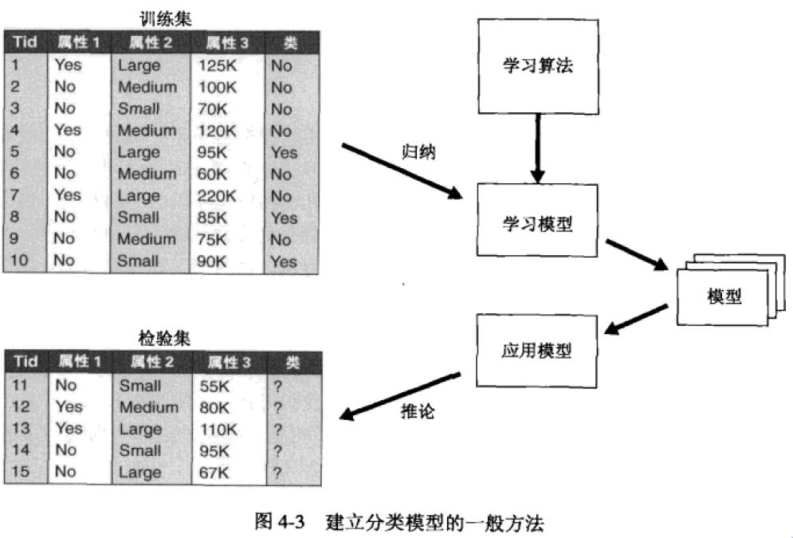
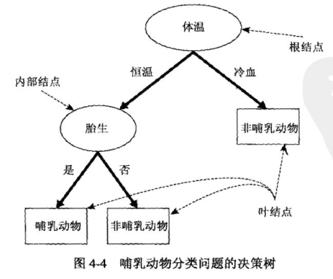
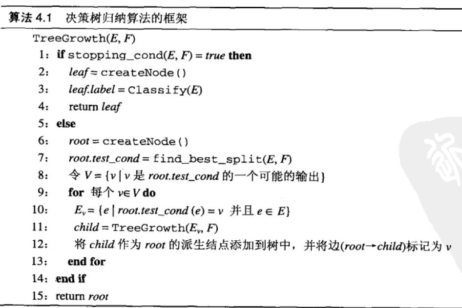
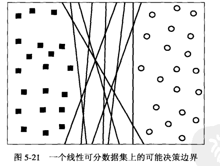

# 第四章 分类：基本概念、决策树与模型评估
## 预备知识
1. 定义4.1 分类：分类任务就是通过学习得到一个目标函数f，把每个属性集x映射到一个预先定义好的类标号y.目标函数也称分类模型。 __分类模型__ 可用于 __描述性建模__ __预测性建模__
## 解决分类问题的一般方法
分类法的例子包括决策树分类法、基于规则的分类法、神经网络、支持向量机和朴素贝叶斯分类法。这些技术都使用一种学习算法确定分类模型，

## 决策树归纳
决策树分类法——一种但却广泛使用的分类技术
### 原理
决策树有三种结点
1. 根节点，它没有入边，但有零边或多条出边
2. 内部结点，恰有一条入边和两条或多条出边
3. 叶结点或终结点，恰有一条入边，没有出边

每个叶结点都赋予一个类标号。非终结点包含属性测试条件
</img>
### 建立决策树
#### Hunt算法
1. 首先选择根节点,再选择一个属性测试条件进行分支
2. 叶结点的判定:所有记录同属一个类,如果不是叶结点,就继续选择属性,进行测试与分支
3. 直到底部都是叶节点

属性测试有其方法:根据属性的类型选择
* 二元属性
* 标称属性
* 序数属性
* 连续属性
  

其他需要注意的:建立决策树之后,可以进行 __树剪枝__ ,以减小决策树规模,决策树过大容易引起 __过分拟合__ 
## 模型的过拟合
过拟合的模型虽然有更多的结点,更好的训练误差,但是检验误差(泛化误差)不行,因为受到样本的噪声干扰,生成了很多噪声结点,降低了模型的性能.
1. 噪声导致的过拟合
2. 缺乏代表性样本导致的过拟合

因此需要正确地评估泛化误差
1. 使用再代入估计
2. 结合模型复杂度.
    * 悲观误差评估
    * 最小描述长度原则
3. 估计统计上界.泛化误差倾向于比训练误差大,所以统计修正通常是计算训练误差的上界.
4. 使用确认集.典型的做法是保留2/3的训练集来建立模型,剩余1/3用作误差估计

评估之后,要对决策树进行处理
1. 先剪枝(提前终止规则),符合评估标准立刻停止扩展叶结点
2. 后剪枝
    * 用新的叶结点替换子树,该叶结点的类标号由子树下记录的多数类确定
    * 用子树中最常用的分支代替子树.

# 第五章 分类:其他技术

## 基于规则的分类器

## 贝叶斯分类器
### 贝叶斯定理
公式:P(Y|X) = P(X|Y)P(Y)/P(X)
### 贝叶斯定理在分类中的应用

## 人工神经网络(ANN)

### 感知器

感知器是ANN中最简单的一种

感知器包含两种结点:输入结点和输出结点.它的原理就是通过训练集不断调整输入结点的加权和偏置因子,来拟合训练集.

### 多层ANN

多层ANN比感知器复杂得多,多了隐藏层,结点之间相互影响,而且也不是单纯的线性关系(包括S型逻辑斯谛函数,双曲正切函数)

## 支持向量机(SVM)

SVM可以很好地运用于高维数据，避免了维灾难的问题。这种方法有一个特点，它使用训练实例的一个子集来表示决策边界，该子集称为支持向量。

### 最大边缘超平面

这样一个数据集，包含两类的样本，分别是方块和圆圈，可以找到这样一个超平面，使得所有的方块在一侧，所有的圆圈在另一侧。

我们假设已经找到了两个决策边界。一个决策边界平移会分别碰到方块和圆圈，可以得到两个超平面，两个超平面的间距称为分类器的边缘。边缘大的的就是训练样本的最大边缘超平面。

原理就是边缘大的决策边界比小的有更好的泛化误差，边缘小的对模型的过分拟合更加敏感。

### 不可分情况下的线性SVM

### 非线性SVM

处理非线性问题的基本方法，就是把变量做一个变换，用变换后的变量求出相应的参数

### 特点

1. SVM学习问题可以表示为图优化问题，可以利用已知的有效算法发现目标函数的全局最小值。而其他方法（如基于规则的分类器和ANN）都采用一种基于贪心学习的策略，这种方法一般只能求得局部最优解
2. SVM通过最大化决策边界的边缘来控制模型的能力。尽管如此，用户必须提供其他参数（如核函数模型，引入松弛变量所需的代价函数C等）
3. 通过对数据中每个分类属性值引入一个哑变量，SVM可以应用于分类数据。如婚姻状况有三个值，可以对每一个属性值引入一个二元变量。

