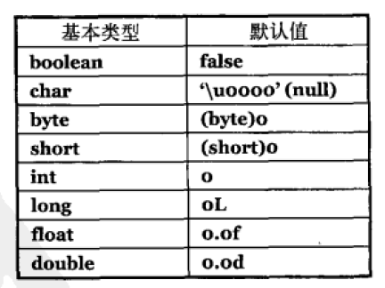

# 第一章 对象导论
## 什么是OOP,OOP有哪些特点
早期的计算机语言是机器的衍生,也就是我们从机器的角度去考虑解决问题的方式.而OOP将问题视作一个个对象,尝试从问题的角度出发.这是一种比较自然的思考方式,在处理大多数的问题上很合适.
## 将对象作为服务提供者
这样可以提高代码的内聚性,其他人理解或者重用你的某个对象时,会比较容易
## 访问控制的优点
1. 保护对象中脆弱的部分,防止他人使用时将其破坏
2. 如果要替换的模块被保护了,那么替换造成的影响是比较小的,使用对象的人无须修改自己的代码

Java与C++和脚本语言的区别.Java没有C++这么多的历史包袱,没有C++灵活.而脚本语言在很多领域的优势在于快速开发,在客户端编程中,脚本语言能帮你解决80%的问题,而剩下的20%最让人头疼的问题,Java解决会比较容易.

高并发包括多进程和多线程?多线程的优势在于不仅可以在多核系统上运行,也可以在多处理器的系统上运行.多线程在于将任务拆分成多个部分,同时运行.它在GUI编程中非常常用,因为GUI编程要求要对用户操作作出迅速反应,它不应该是阻塞的.多个线程访问一个资源时,有时是不可行的,这时需要锁这个概念.

# 第二章 一切都是对象

创建对象存储到以下五个地方之一

1. 寄存器
2. 堆栈
3. 堆
4. 常量存储
5. 非RAM存储


java除了基本类型，还在类库中提供了BigIntegar和BigDecimal，分别支持任意精度的整数和任何精度的定点数

java中的数组和c/c++不同，c/c++的数组就是一个连续内存块，而Java中的数组作了处理，使得数组更加安全。c++中有std::array，比单纯的c数组更安全。c中数组名和下标互换的原理是a[b]等价于*(a+b)

## 永远不需要销毁对象

### 作用域

Java中的嵌套代码块，子代码块可以访问父代码块中的变量，而c/c++不行

由new创建的对象在作用域结束之后依然会存在，在c++中，需要手动释放这些空间。而Java有一个垃圾回收器，会自动地回收。

## 创建新的数据类型：类

一个类的成员分为字段和方法，字段在类被初始化后，是有一个默认值的。

</img>

C/C++中的函数在Java里常被称为方法(method)

static变量和方法无论是否初始化，都指向同一个东西

## 注释与文档

Java中的注释有C式的/* */，也有C++式的//。

 javadoc文档有两种方式，一是使用内嵌html，二是使用文档标签。以开始，每一行前面都要有，以*/结尾。

```Java
//:object/Documentation1.java
/** A class comment */
public class Documentation1{
  /** A field comment*/
  public int i;
  /** A method comment */
  public void() f() {}
}///:~
//这是分层的注释文档
/**
* <pre>
* System.out.println(new Date());
* </pre>
*/
//内嵌html
@see classname //这是@see标签
```

文档示例

```Java
//:object/HelloDate.java
import java.util.*;
/** The firsh Thinking in Java example program.
 * Displays a string and today's date.
 * @author Bruce Eckel
 * @author www.MinView.net
 * @version 4.0
*/
public class HelloDate {
  /** Entry point to class & application.
   * @param args array of string arguments
   * @throws exceptions No exceptions thrown
   */
  public static void main(String[] args) {
    System.out.println("Hello, it's:");
    System.out.println(new Date());
  }
}/* Output: (55% match)
Hello, it's:
Wed Oct...
*///:~
```

/*Output标签表示输出的开始部分将由这个文件生成，通过这种形式，它会被自动地测试，一验证其准确性。(55% match)在向测试系统说明输出与这里列出的只有55%的相关性。

# 第三章 操作符

加减乘除和=号用法与其他语言区别不大。

+-*/的对象是基本类型，= != ==这些操作符能操作所有对象，String类也支持+和+=

优先级上，*和/高于+和-

一元加减号和二元加减号会被编译器识别出来，x = a * -b会等价于x = a * (-b)

java的关系操作符比较的是对象的引用，如果要比较对象的内容，那么使用equals()，但equals()不适用于基本类型。但是如果自己创建了新的类，类自带的默认equals()方法是比较引用的，我们要对它“重载”？

java中也是存在逻辑短路现象的

java中的移位有三种，左移<< 有符号右移>> 无符号右移>>>，char short等都会被转换成int移位，只用数值右端5位，返回int，而long则只会用到数值右端的低6位，返回int

三元操作符if-else，它与if-else仅仅在逻辑上相似，写作? :

