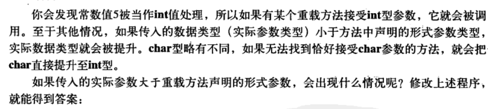
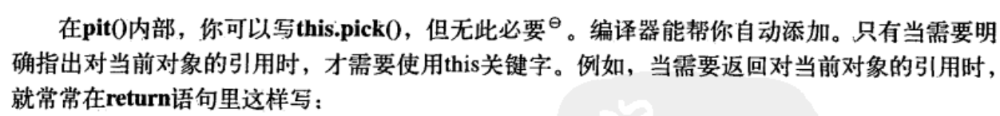
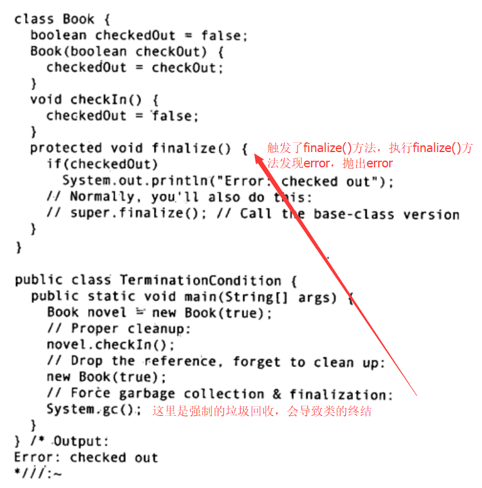
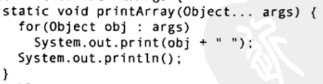
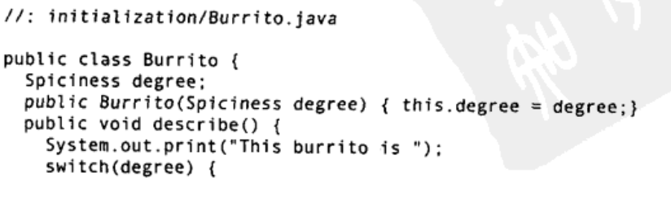
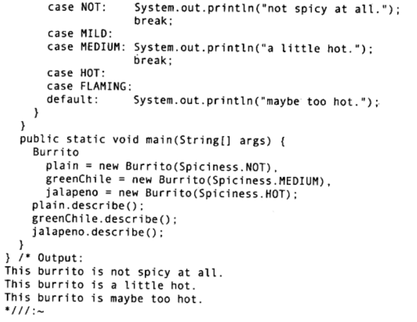

# 控制执行流程

在java中if-else语句的条件只能是 __boolean__ 值，java不会对条件内的表达式作任何的 __自动类型转换__ ，从而避免了一些错误。

for语句的顺序：执行 __初始化__ ， __条件判断__ ，迭代语句， __进行某种形式的步进__

java中唯一用到逗号操作符的是for循环的控制表达式

## foreach
```Java
float f[] = new float[18];
for (float x : f) {
    System.out.println(x);
}
```
f可以是数组，也可以Iterable对象

我在之前学习python的时候也遇到过，python里也有for i in ...的用法。构建一个迭代器使用yield关键字，它使得函数返回一个值，并在下一次被调用的时候从这个关键字这里开始执行

## goto

java中标签只能 __刚好位于迭代语句之前__ ，break+标签和continue+标签可以实现跳转

## switch

switch可以实现多路选择，当我们要使用float作为选择的对象时，可以用 __enum__ 关键字

# 初始化与清理

和C++中一样，java的 __构造函数与类名相同__，构造函数也可以重载，可以有参数，无参的那个叫做 __默认构造器__

## 方法重载

在java中，基本类型可能会自动地从小类型转换成大类型，这可能会造成重载方法的混淆

如果有某个重载方法地参数类型恰好相同，那么直接使用，如果没有，就找大类型地重载方法，并提升类型


还可以用返回值来判断用哪个重载方法



## 清理:终结处理finalize()
1. 对象可能不被垃圾回收
2. 垃圾回收不等于析构
3. 垃圾回收只与内存有关

在C++中，所有地对象最终都会被销毁，而Java中，对象可能不会被垃圾回收，除非内存耗尽。



## 初始化

初始化的顺序是，所有的变量先进行初始化，然后执行构造函数。未赋值的基本类型是有一个初值的。

## 数组初始化

数组的复制仅仅传递了一个引用

### 可变参数列表


## 枚举初始化



# 访问控制权限
## 包：库单元
在java中，Java包的命名规则全部使用小写字母，包括中间的字

package和CLASSPATH是离不开的，package的路径是从classpath里面查询的。

## 权限访问修饰词

默认访问权限没有任何关键字，但通常是指 __包访问权限__ ，意味着，当前包中的类可以访问那个成员，但对包外的所有类，那个成员是private

如果两个java文件在同一目录下，且没有给自己设定任何包名称，同时CLASSPATH中有"."，java把它们看作隶属于该目录的默认包

## 类访问权限

一个java文件只能有一个public类，它的名字必须与文件名一致